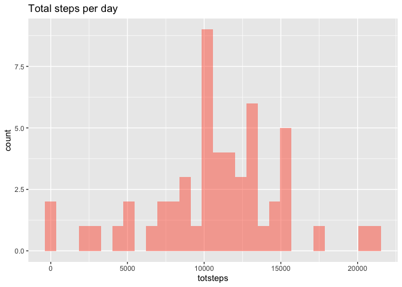
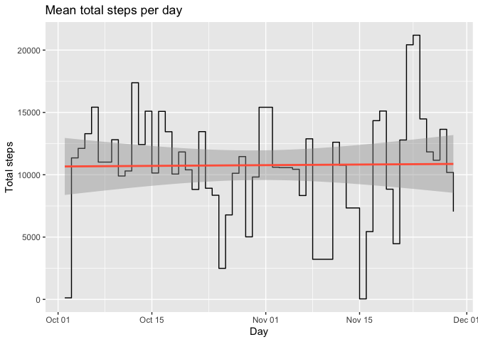
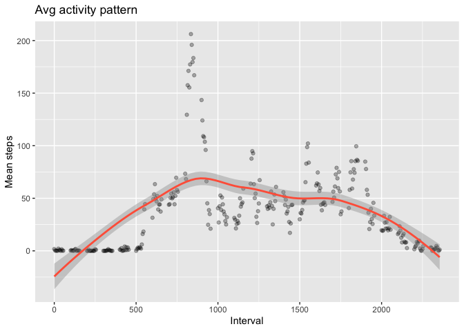
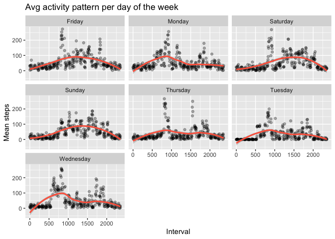

## Loading and preprocessing the data

### install and load needed libraries

```r
installif <- function(p) {
    if (!p %in% rownames(installed.packages()))
        install.packages(p)
    TRUE
}
sapply(c("dplyr", "ggplot2", "lubridate"), installif)
```

```
##     dplyr   ggplot2 lubridate 
##      TRUE      TRUE      TRUE
```

```r
library(dplyr)
```

```
## Warning: package 'dplyr' was built under R version 3.5.2
```

```
## 
## Attaching package: 'dplyr'
```

```
## The following objects are masked from 'package:stats':
## 
##     filter, lag
```

```
## The following objects are masked from 'package:base':
## 
##     intersect, setdiff, setequal, union
```

```r
library(ggplot2)
library(lubridate)
```

```
## 
## Attaching package: 'lubridate'
```

```
## The following object is masked from 'package:base':
## 
##     date
```

### fetch the zip file from internet and extract content (if needed)


```r
destZipFile <- './activity.zip'
fileUrl<-"https://d396qusza40orc.cloudfront.net/repdata%2Fdata%2Factivity.zip"
if(!file.exists(destZipFile)) {
    download.file(fileUrl, destfile = destZipFile, method = "curl")
    unzip(destZipFile, overwrite = T)
}
```

### fix a seed to show reproducible results

```r
set.seed(1234)
```

### reads the content

```r
df <- read.csv("./activity.csv")
```

Structure of dataframe...

```r
str(df)
```

```
## 'data.frame':	17568 obs. of  3 variables:
##  $ steps   : int  NA NA NA NA NA NA NA NA NA NA ...
##  $ date    : Factor w/ 61 levels "2012-10-01","2012-10-02",..: 1 1 1 1 1 1 1 1 1 1 ...
##  $ interval: int  0 5 10 15 20 25 30 35 40 45 ...
```
Some basic statistics...

```r
summary(df)
```

```
##      steps                date          interval     
##  Min.   :  0.00   2012-10-01:  288   Min.   :   0.0  
##  1st Qu.:  0.00   2012-10-02:  288   1st Qu.: 588.8  
##  Median :  0.00   2012-10-03:  288   Median :1177.5  
##  Mean   : 37.38   2012-10-04:  288   Mean   :1177.5  
##  3rd Qu.: 12.00   2012-10-05:  288   3rd Qu.:1766.2  
##  Max.   :806.00   2012-10-06:  288   Max.   :2355.0  
##  NA's   :2304     (Other)   :15840
```

let's fix the dates and use a clean version without missing values

```r
df <- df %>% mutate(fixeddate = ymd(date)) %>% select(-date)
cleandf <- na.omit(df)
```

## What is mean total number of steps taken per day?

```r
totaldf <- cleandf %>% 
    group_by(fixeddate) %>% 
    summarise(totsteps=sum(steps), meansteps=mean(steps), mediansteps=median(steps))

as_tibble(totaldf)
```

```
## # A tibble: 53 x 4
##    fixeddate  totsteps meansteps mediansteps
##    <date>        <int>     <dbl>       <dbl>
##  1 2012-10-02      126     0.438           0
##  2 2012-10-03    11352    39.4             0
##  3 2012-10-04    12116    42.1             0
##  4 2012-10-05    13294    46.2             0
##  5 2012-10-06    15420    53.5             0
##  6 2012-10-07    11015    38.2             0
##  7 2012-10-09    12811    44.5             0
##  8 2012-10-10     9900    34.4             0
##  9 2012-10-11    10304    35.8             0
## 10 2012-10-12    17382    60.4             0
## # … with 43 more rows
```
histogram total numbers of steps per day:

```r
ggplot(totaldf) + 
    geom_histogram(aes(meansteps), fill='tomato', alpha=.5) + 
    labs(title='Total steps per day')
```

```
## `stat_bin()` using `bins = 30`. Pick better value with `binwidth`.
```

<!-- -->

Let's check how this looks in a plot, with some quick categories based on the level of activity:

```r
ggplot(totaldf, aes( fixeddate, totsteps ) ) + 
    geom_step() + 
    geom_smooth(method=lm, color="tomato") +
    labs(title = 'Mean total steps per day', x = 'Day', y = 'Total steps') 
```

<!-- -->

As you can see, the red line (linear model) is also showing a the mean of the total steps per day.

## What is the average daily activity pattern?


```r
dpattern <- cleandf %>% 
    group_by(interval) %>% 
    summarise(steps=mean(steps))

ggplot(dpattern, aes( interval, steps )) + 
    geom_point(alpha=3/10) + 
    geom_smooth(color="tomato") +
    labs(title = 'Avg activity pattern', x = 'Interval', y = 'Mean steps') 
```

```
## `geom_smooth()` using method = 'loess' and formula 'y ~ x'
```

<!-- -->

## Imputing missing values

How many NAs do we have?

```r
summary(df)
```

```
##      steps           interval        fixeddate         
##  Min.   :  0.00   Min.   :   0.0   Min.   :2012-10-01  
##  1st Qu.:  0.00   1st Qu.: 588.8   1st Qu.:2012-10-16  
##  Median :  0.00   Median :1177.5   Median :2012-10-31  
##  Mean   : 37.38   Mean   :1177.5   Mean   :2012-10-31  
##  3rd Qu.: 12.00   3rd Qu.:1766.2   3rd Qu.:2012-11-15  
##  Max.   :806.00   Max.   :2355.0   Max.   :2012-11-30  
##  NA's   :2304
```
It looks like we have 2304 NA's. We are going to use Amelia library to complete (impute) it:

```r
installif("Amelia")
```

```
## [1] TRUE
```

```r
library(Amelia)
```

```
## Loading required package: Rcpp
```

```
## Warning: package 'Rcpp' was built under R version 3.5.2
```

```
## ## 
## ## Amelia II: Multiple Imputation
## ## (Version 1.7.5, built: 2018-05-07)
## ## Copyright (C) 2005-2019 James Honaker, Gary King and Matthew Blackwell
## ## Refer to http://gking.harvard.edu/amelia/ for more information
## ##
```

```r
amelia_fit <- amelia(
    df, 
    m=1, 
    parallel = "multicore", 
    bounds = matrix( c(1,0,max(df$steps)), nrow=1, ncol=3))
```

```
## -- Imputation 1 --
## 
##   1  2
```

```r
imputed <- amelia_fit$imputations[[1]]

print(dim(df)==dim(imputed))
```

```
## [1] TRUE TRUE
```

```r
summary(imputed)
```

```
##      steps           interval        fixeddate         
##  Min.   :  0.00   Min.   :   0.0   Min.   :2012-10-01  
##  1st Qu.:  0.00   1st Qu.: 588.8   1st Qu.:2012-10-16  
##  Median :  0.00   Median :1177.5   Median :2012-10-31  
##  Mean   : 46.73   Mean   :1177.5   Mean   :2012-10-31  
##  3rd Qu.: 40.00   3rd Qu.:1766.2   3rd Qu.:2012-11-15  
##  Max.   :806.00   Max.   :2355.0   Max.   :2012-11-30
```

## Are there differences in activity patterns between weekdays and weekends?


```r
wpattern <- imputed %>% 
    mutate( wday = weekdays(fixeddate)) %>%
    group_by(wday, interval) %>% 
    summarise(meansteps=mean(steps))

ggplot(wpattern, aes( interval, meansteps )) + 
    geom_point(alpha=3/10) + 
    geom_smooth( color="tomato") +
    facet_wrap(wday~.) +
    labs(title = 'Avg activity pattern per day of the week', x = 'Interval', y = 'Mean steps') 
```

```
## `geom_smooth()` using method = 'loess' and formula 'y ~ x'
```

<!-- -->
